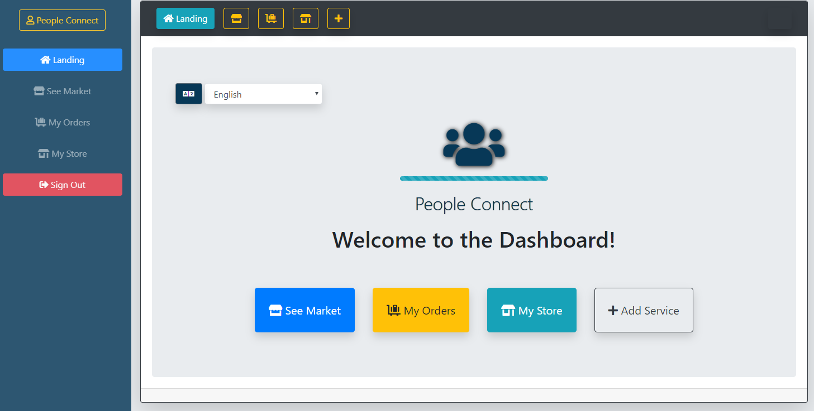
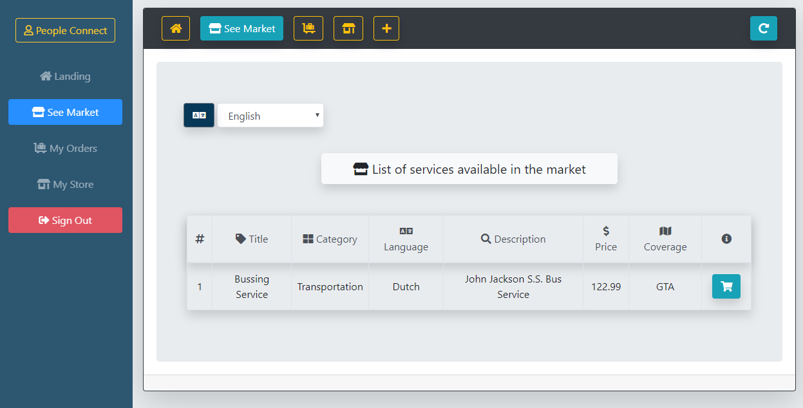
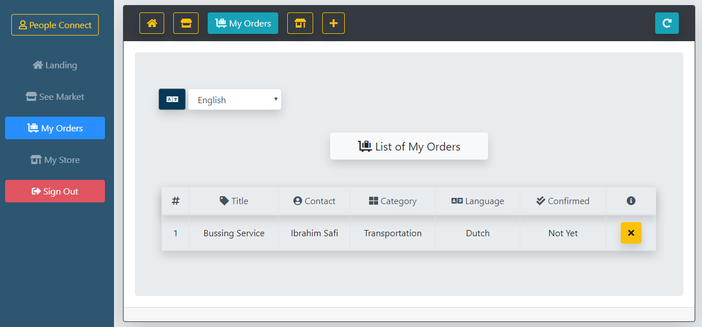
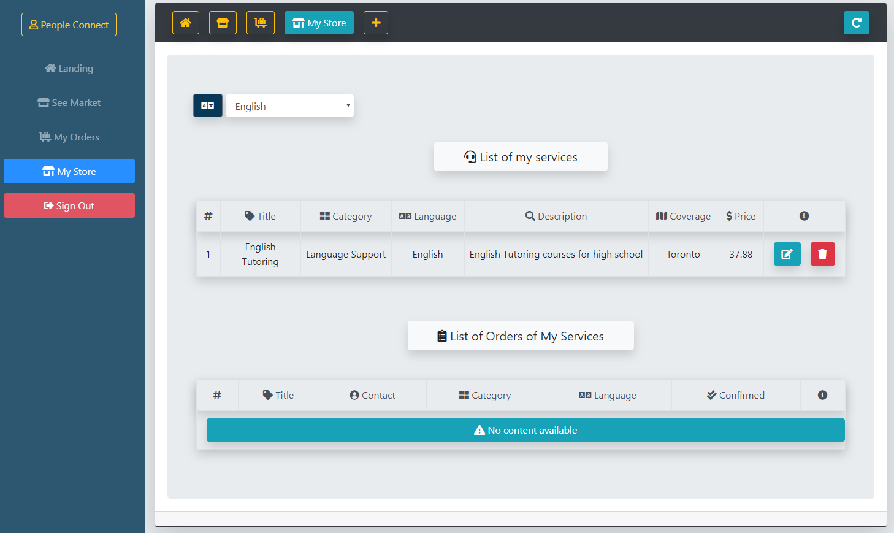
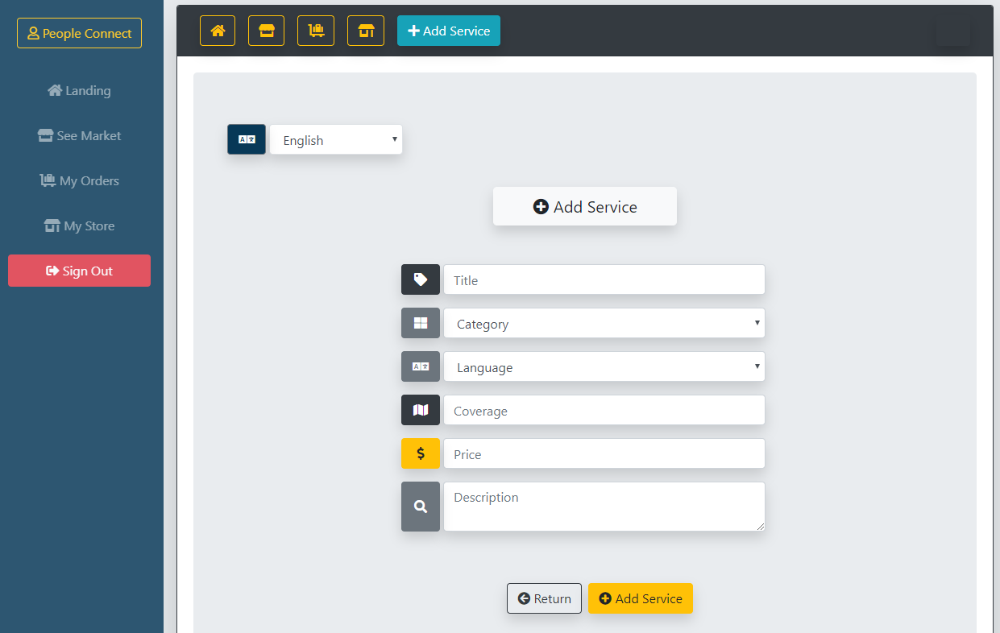

# People Connect App using React

## Overview:
This application is built for connecting people in the community who speak the same language by providing day-to-day essential services. Also, this app can support new-comer families easily get familiar with the community and make strong bonds with the community. This application is equipped with React, NodeJS and MongoDB stack. 

## Project Dependencies:
This app requires these node packages: `express`, `bcryptjs`, `cookie-parser`, `dotenv`, `express-session`, `i18next`, `mongoose`, `axios`.

## The App Features:
* Polished Front-End, Iconic design, and full-responsive (desktop and mobile) layout; by using Bootstrap, FontAwesome, and React frameworks.

* Multi-language capability; supports four languages; `Arabic`, `English`, `Ukrainian`, `Portuguese`, as the user can change the app's language at anytime and any point.

## Basic Usage:
* The app runs by navigating into the directory of the app folder, and then type the command  `npm start` in the command line terminal.

* To access the app, open the web-browser and navigate to: "localhost:3000".

* After, the user signed-in, the app's dashboard will show to user four main tabs; `See Market`, `My Orders`, `My Store`, and `Add Service`. see the following screenshot.

* In `See Market` tab, the app shows all available provided services in a table, as the user can `purchase` a service by clicking on the `cart` icon. see the following screenshot.

* In the `My Orders` tab, the app shows all ordered services in a table, as the user can see the confirmation status of the service provider, and cancel the deal if wanted. see the following screenshot.

* In the `My Store` tab, the app shows a list all user's services and a list all orders of user's services, as the user can edit or delete services, and confirm or cancel orders. see the following screenshot.

* In the `Add service` tab, app shows a form of adding new service as the user is the service provider. see the following screenshot.

## Try it on HEROKU:
This link will jump you to test the application, have fun!
 
  * ["Try it"](https://damp-refuge-73768.herokuapp.com/)
